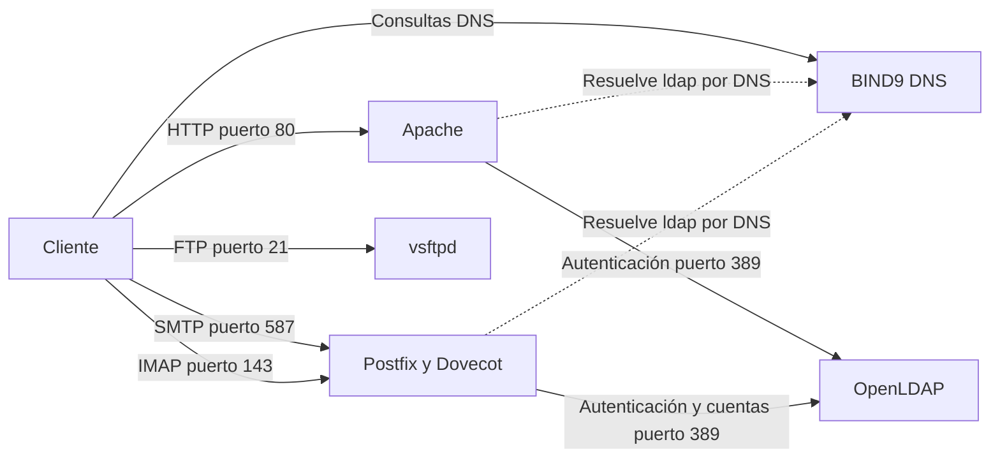

# Arquitectura de servicios

## Responsabilidades

| Componente | Se conecta con | Propósito |
|---|---|---|
| Cliente | DNS | Resolver nombres del dominio |
| Cliente | Apache | Abrir el sitio y probar el acceso protegido |
| Cliente | Correo | Enviar por SMTP y leer por IMAP |
| Cliente | FTP | Listar, cargar y descargar archivos |
| Apache | LDAP | Validar usuario y contraseña |
| Postfix | LDAP | Comprobar que el destinatario existe |
| Dovecot | LDAP | Autenticar el acceso al buzón |
| FTP | Usuario local | Autenticar sin depender de LDAP |

Todas las conexiones entre servicios utilizan nombres DNS. No se requieren
entradas manuales en el archivo `hosts`.
